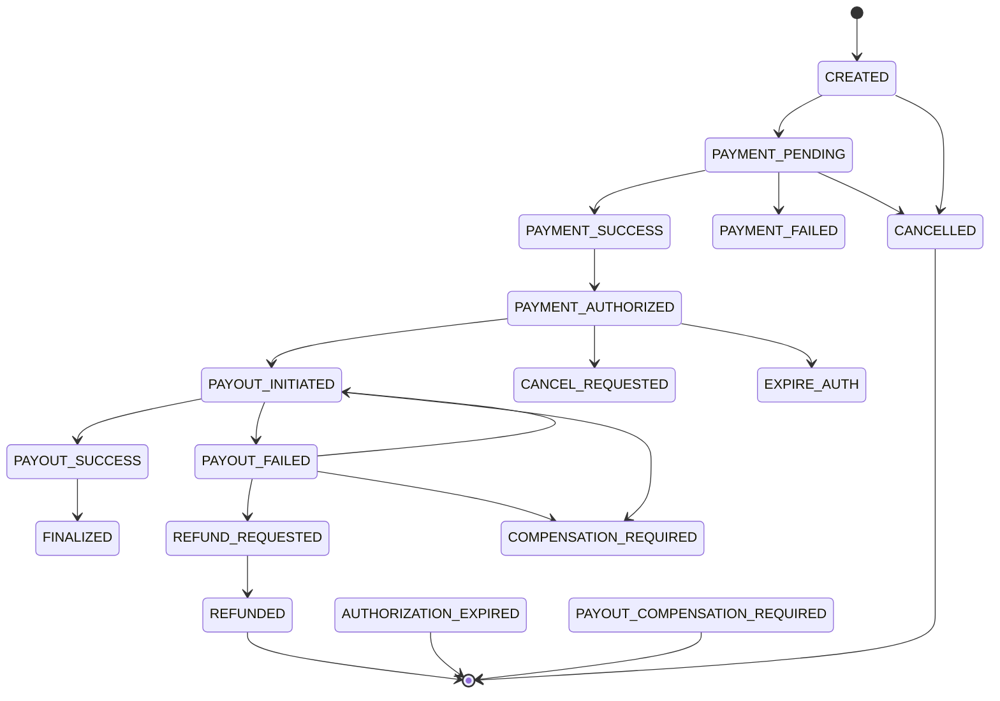

# AlmaPay Backend – Bank-Grade Remittance System

A production-grade financial services backend for secure remittances from the UK to East Africa (KES, UGX, TZS, SOS).

Built with Node.js, Express, TypeScript, PostgreSQL, Prisma, and designed for auditability, regulatory compliance, and operational safety.

## 🚀 Key Features

### 🏦 Immutable Ledger
- All financial activity is recorded in `LedgerEntry`.
- **Source of Truth**: Enforces debit/credit invariants directly in the database.
- **Monotonic Sequences**: Per `user`+`currency` account to prevent race conditions.
- **Atomic Locking**: All balance updates use `SELECT ... FOR UPDATE`.
- `User.balance` is strictly a cache; all calculations are ledger-derived.

### 🔄 Strict State Machine
- Deterministic transaction lifecycle.
- **Finality**: Economic (money moved) vs Legal (chargeback window closed).
- **Compensation**: Dedicated states for partial failures (`PAYOUT_COMPENSATION_REQUIRED`).

### 🛡️ Regulatory Compliance
- Mandatory KYC & AML checks.
- **Risk controls**: velocity & frequency caps.
- **Corridor control**: instant disablement of specific currency pairs (e.g., GBP→UGX).
- Audit logs retained for 7 years.

### ⚡ Exact-Once Internal Settlement
- **Hard Idempotency**: `Idempotency-Key` required for all POST transactions.
- **Payout Locking**: Unique `payoutProviderRef`.
- **Outbox Pattern**: Guarantees notifications & provider calls.
- **Crash Recovery**: `PENDING` events automatically retried.
- **Dead Letter Queue (DLQ)**: Max-retry events flagged for Ops review.

### 👮 RBAC & Audit
- **Roles**: `SUPPORT` (Read-only), `OPS` (Retry/Refund), `SUPER_ADMIN` (Settlement/Freeze).
- **Immutable AdminActionLog** for every sensitive action.
- **Kill-switches**: freeze users, block recipients, toggle providers.

## 🏗️ Architecture & Safety Standards

### Ledger is Truth
- **Single DEBIT** per transaction at creation.
- **Mutually Exclusive Credits**: `PAYOUT_SUCCESS` OR `REFUND` OR `CHARGEBACK`.
- **Atomic Locking**: All financial writes locked via `SELECT ... FOR UPDATE`.
- **Rounding**: `decimal.js` used; minor unit rounding (2dp GBP/KES, 0dp UGX/RWF).

### Transaction State Machine


### Operational Policies & SLA
- **Authorization expiry**: 7 days.
- **Provisional payout window**: 24 hours.
- **Chargeback exposure**: 120 days.
- **Settlement SLA**: 24 hours after provider confirmation.
- **Retries**: Max 5 with exponential backoff (`interval * 2^retries`).
- **DLQ**: Failing webhooks/outbox events flagged for Ops review.
- **Alerting**:
    - **CRITICAL** → PagerDuty (Ledger/System failures).
    - **WARNING** → Slack (#ops-alerts) (Limit breaches / Queue size).

## 🔌 API Endpoints (v1)

All endpoints prefixed with `/api/v1`.
**Security Headers**:
- `Authorization`: Bearer `<access_token>`
- `Idempotency-Key` (required for POSTs)

### System & Health
```text
GET /health       # System integrity
GET /rates        # Current regulatory exchange rates
```

### Authentication
```text
POST /auth/register       # Create user + trigger KYC
POST /auth/login          # Login, returns access/refresh tokens
POST /auth/refresh-token  # Rotate access token
POST /auth/logout         # Revoke tokens
POST /auth/change-password# Change password
```
*Session Control: Access Token 15m, Refresh Token 7d (HttpOnly cookie recommended).*

### Transactions
```text
POST /transactions/send
# [Idempotent] Initiate remittance
# Errors: 403 Forbidden, 409 Conflict, 422 Unprocessable

GET /transactions/:id/status     # Poll status
GET /transactions/:id/receipt    # PDF receipt
GET /transactions/calculate      # Fee/Rate calculator
```

**Example request**:
```bash
curl -X POST "https://api.almapay.com/api/v1/transactions/send" \
-H "Authorization: Bearer $ACCESS_TOKEN" \
-H "Idempotency-Key: abc123" \
-H "Content-Type: application/json" \
-d '{
  "amount": 100,
  "currency": "GBP",
  "recipientId": "recip_456"
}'
```

### Compliance & Limits
```text
GET /compliance/postcode-lookup
GET /compliance/limits
PATCH /compliance/profile    # DOB, Address update
```

### Admin Operations (RBAC Protected)

**Transaction Management**
```text
POST /admin/transactions/:id/retry
POST /admin/transactions/:id/cancel
POST /admin/transactions/:id/refund
POST /admin/transactions/:id/finalize
POST /admin/transactions/:id/lock
```

**Safety & Kill-Switches**
```text
POST /admin/users/:id/freeze
POST /admin/users/:id/enable
GET  /admin/users/:id/limits
POST /admin/recipients/:id/block
POST /admin/recipients/:id/unblock
POST /admin/corridors/:from/:to/disable
POST /admin/corridors/:from/:to/enable
```

**Reconciliation & Reliability**
```text
POST /admin/reconciliation/run
GET  /admin/reconciliation/:provider
GET  /admin/webhooks/failed
POST /admin/webhooks/:id/retry
GET  /admin/outbox/pending
POST /admin/outbox/:id/process
GET  /admin/providers/status
POST /admin/providers/:name/toggle
```

**Disputes**
```text
GET  /admin/disputes
POST /admin/disputes/:id/mark-won
POST /admin/disputes/:id/mark-lost
POST /admin/disputes/:id/freeze-tx
```

## 🛡️ Security Implementation
- **Helmet headers**: 15+ active headers.
- **Rate Limiting**: IP / User / Route.
- **Validation**: Strict Zod schemas.
- **Arithmetic**: `decimal.js` (minor-unit rounding).
- **Sessions**: JWT Access Tokens 15m + rotation.
- **Audit Logging**: 7-year retention.
  ```json
  {
    "adminId": "uuid",
    "action": "FREEZE_USER",
    "targetId": "user_123",
    "reason": "Suspicious activity detected",
    "ip": "1.2.3.4",
    "timestamp": "ISO8601"
  }
  ```

## 🛠️ Setup & Development

### Development
```bash
npm install
npx prisma db push
npm run dev
```

### Production
```bash
npm install
npx prisma migrate deploy
npm run start
```


## 🧩 Standardized Error Responses
All API errors follow this format:
```json
{
  "status": "error",
  "code": "USER_FROZEN", // Machine-readable
  "message": "Account is frozen due to compliance check.", // Human-readable
  "details": [] // Optional validation issues
}
```

| HTTP | Code | Description |
| :--- | :--- | :--- |
| `400` | `VALIDATION_ERROR` | Invalid input (see `details`). |
| `400` | `INVALID_STATE_TRANSITION` | Illegal state move (e.g. `CANCEL` -> `PAYOUT`). |
| `401` | `UNAUTHORIZED` | Missing or invalid Bearer token. |
| `403` | `USER_FROZEN` | Account frozen by Admin/Compliance. |
| `403` | `SANCTION_HIT` | Recipient is on a blocklist. |
| `409` | `RESOURCE_CONFLICT` | Duplicate ID or Unique constraint. |
| `409` | `LIMIT_EXCEEDED` | Daily/Monthly velocity limit reached. |
| `422` | `CORRIDOR_DISABLED` | Currency route is currently inactive. |
| `500` | `INTERNAL_SERVER_ERROR` | System failure (Page Ops). |

## 📊 Observability & Monitoring
- **Logs**: Structured JSON logs (`AdminActionLog`) for all side-effects.
- **Metrics**:
    - `http_request_duration_seconds` (Histogram)
    - `transaction_status_total` (Counter: `success`, `failed`, `pending`)
    - `outbox_queue_depth` (Gauge)
- **Tracing**: `correlation-id` passed in headers for Distributed Tracing.

## ⚖️ Compliance & Edge Cases
- **KYC Failure**: User stuck in `kycTier: 0`. Requires explicit `PATCH /profile` correction or Admin override.
- **Sanctions Match**:
    - Transaction: Immediately `CANCELLED`.
    - User/Recipient: Marked `isFrozen` / `isBlocked`.
    - **Resolution**: Manual Admin review via `/admin/disputes`.
- **PEPs (Politically Exposed Persons)**: Flagged via `riskLevel: HIGH`. Requires distinct approval flow (Future V2).

## 📆 Versioning Policy
- **Current Version**: `v1` (Stable).
- **Deprecation**: 12-month notice before breaking changes.
- **Strategy**: URL-based versioning (`/api/v1/...`, `/api/v2/...`).

## 🧪 Testing & CI/CD
- **Unit Tests**: `npm run test:unit` (Jest) - Covers logic & state machine.
- **Integration Tests**: `npm run test:int` (Supertest) - Covers API flows.
- **Deployment**:
    - `Main`: Auto-deploy to Staging.
    - `Tag (v*)`: Auto-deploy to Production (after Approval).

## 📄 License
MIT
